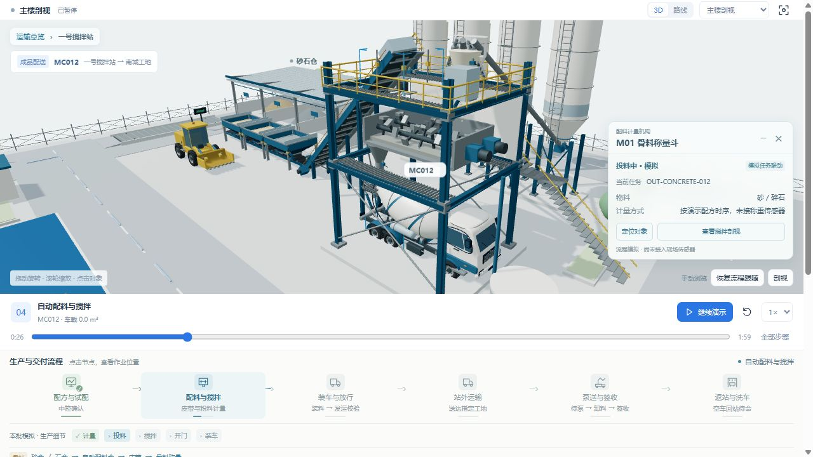
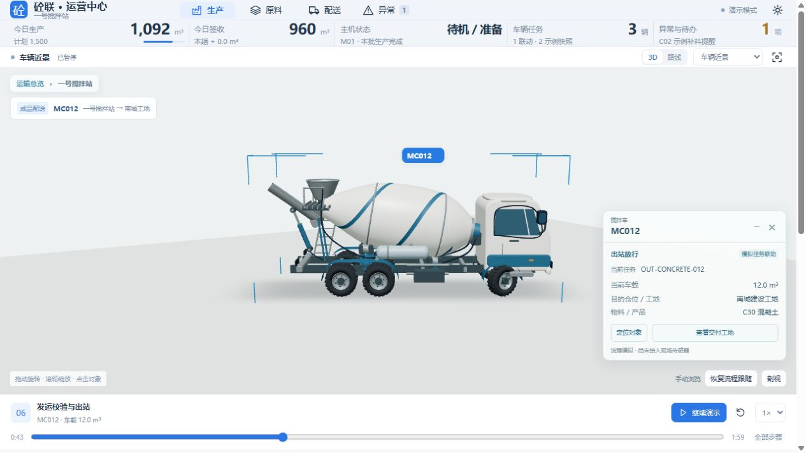
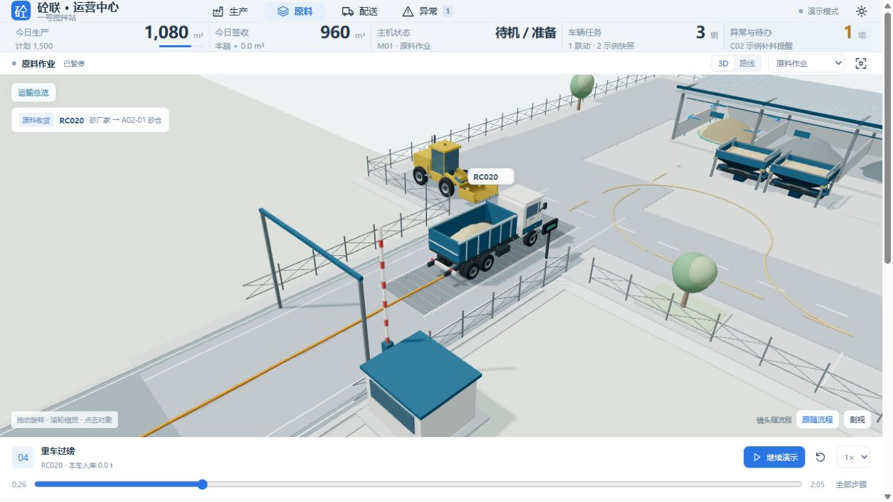
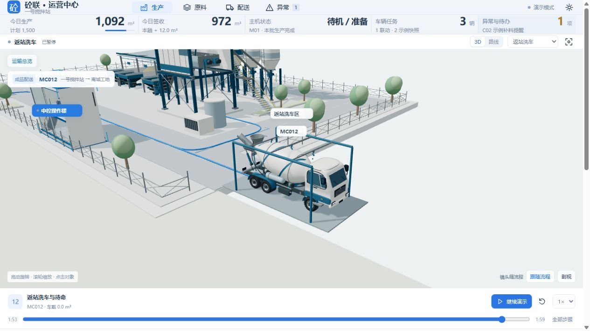

# Codex 挑战 Opus 5.5：商混全流程 3D 建模与交互

**砼联 · Concrete Operations 3D — V6**

商品混凝土生产与物流的可交互 3D 原型。使用 React、Three.js 和 React Three Fiber，以程序化几何展示设备、车辆和业务流程；运行数据来自确定性的本地模拟。

An interactive 3D prototype for ready-mix concrete production and logistics, built with React, Three.js and React Three Fiber. Equipment and vehicles use procedural geometry; operational data comes from deterministic local simulations.






## 可以体验 / What you can explore

- **五项完整模拟任务**：砂、碎石、水泥、粉煤灰的厂家装车、运输、登记、过磅、验收、分仓卸料、复磅入库与供料；混凝土的配方预演、生产、装车、配送、泵送、签收、返站与洗车。  
  **Five simulated tasks:** sand, stone, cement and fly-ash receiving and supply, plus concrete production and delivery through pumping, signature, return and washing.
- **宽幅 3D 与地点地图**：从厂家、搅拌站、工地三个入口进入局部内容；返回地图保留当前任务与进度。支持旋转、缩放、暂停、调速和阶段跳转。  
  **Wide 3D views and a location map:** enter the supplier, plant or construction site while retaining task progress. Orbit, zoom, pause, change playback speed or seek to a stage.
- **入口称重与卸料通道**：齐平地磅位于入口直线通道，满载上磅、空车复磅和离场均前进；完整车尾离磅后再转弯。配料斗之间保留碎石卸料通道，封闭集料带下穿承重盖板，粉料车辆从仓棚外绕行。  
  **Entrance weighing and unloading access:** a flush bridge serves forward gross and tare passes; turns begin after the entire truck clears the deck. The stone unloading lane separates the bins, with a covered collector below it, and powder trucks bypass the storage building.
- **洗车自动跟随**：返站地图自动进入洗车区 3D 镜头，跟随进场、停留冲洗，完成后保留该画面；点击最后一个流程节点也能查看车辆与洗车设施。  
  **Automatic washing view:** the return map transitions to a 3D washing view that follows the approach and stays through washing and completion. The final process node also locates the truck and washing facility.
- **现场对象卡**：点击模型或流程节点查看状态、关联任务和关键字段；可定位、收起、关闭或使用 Esc。手动操作接管镜头，一键恢复流程跟随。  
  **On-site object cards:** inspect status, task and key fields, locate an object, collapse or dismiss the card. Manual camera control can be followed by explicit restoration of workflow tracking.
- **可读的生产工艺**：骨料、粉料、水和外加剂路线分别显示；生产段展开计量、投料、搅拌、开门和装车副步骤，关联相应模型。  
  **Readable production flow:** separate aggregate, powder, water and admixture paths, with metering, charging, mixing, gate-opening and truck-loading substeps linked to the model.
- **HTML 与 GLB 导出**：构建生成独立 HTML；界面可导出当前 3D 场景。GLB 保存几何、材质和当时姿态，交互及业务动画逻辑保留在网页源码中。  
  **HTML and GLB export:** build a standalone HTML preview or export the current 3D scene. GLB contains geometry, materials and a pose snapshot; interactive workflow logic remains in the web source.

## 直接预览 / Open the preview

解压源码包后，双击项目根目录的 `index.html`，会自动打开独立预览 `dist/index.html`；也可以直接双击 `dist/index.html`。查看预览无需安装 Node.js，也无需执行 `npm install`。

After extracting the source package, double-click `index.html` in the project root. It automatically opens the standalone preview at `dist/index.html`; you can also open `dist/index.html` directly. Viewing the preview requires neither Node.js nor `npm install`.

## 本地开发 / Develop locally

修改源码、运行开发服务器及执行验证需要 **Node.js 22 或以上**。在项目根目录执行：  
Editing the source, running the development server and executing verification scripts require **Node.js 22+**. Run from the project root:

```sh
npm install
npm run dev
```

开发地址：`http://127.0.0.1:5178`。  
Development server: `http://127.0.0.1:5178`.

```sh
npm run build
npm test
```

构建结果为 `dist/index.html`，模型、JavaScript 和 CSS 已嵌入。验证脚本覆盖业务门控、运动和交互状态；浏览器外观及性能记录见 [VALIDATION.txt](VALIDATION.txt)，其测量条件与限制应一起阅读。  
The build produces `dist/index.html` with embedded models, JavaScript and CSS. Verification scripts check business gates, motion and interaction state. Browser and performance observations are recorded in [VALIDATION.txt](VALIDATION.txt), alongside their measurement conditions and limitations.

验证随项目提供的模型：  
Verify the supplied model:

```sh
npm run test:glb
```

模型位置：`models/ready-mix-plant-v6.glb`。该文件是静态场景快照。  
Model location: `models/ready-mix-plant-v6.glb`. This file is a static scene snapshot.

## 静态演示发布 / Static demo publishing

执行 `npm run build` 后，可将 `dist` 的内容发布到 GitHub Pages 或其他静态托管服务，以 `index.html` 为入口。此仓库说明提供发布方式；在线地址与部署配置由作者设置。  
After `npm run build`, publish the contents of `dist` to GitHub Pages or another static host, with `index.html` as the entry point. The author supplies the deployment configuration and public demo URL.

## 资产标识示例 / Example asset IDs

模型中的 `userData.entityId` 用于对象定位与业务关联。  
Model `userData.entityId` values connect object selection and workflow context.

| ID | 业务对象 / Object |
| --- | --- |
| `aggregate-sand` | A02-01 砂仓 / Sand storage bay |
| `cement-c01` | C01 水泥筒仓 / Cement silo |
| `mixer-m01` | M01 搅拌主楼 / Mixing tower |
| `truck-mc012` | MC012 搅拌车 / Mixer truck |
| `construction-site` | 配送工地 / Delivery site |

## 使用边界与协作 / Scope and collaboration

当前版本使用模拟流程及明确标识的基准快照，**未接入 PLC、真实地磅、GPS、料位传感器或电子签收**。路线与时间经过示意化、压缩处理；设备尺寸不作为施工图依据，配方和试配预演不代表真实质量检验。性能随设备、浏览器、视角及画布尺寸变化，项目不承诺固定帧率或与外部演示的性能等同。

This version uses simulated workflows and labelled baseline snapshots. **It has no live PLC, weighbridge, GPS, level-sensor or electronic-signature integration.** Routes and timings are illustrative and compressed. Equipment dimensions are not construction drawings; recipe and trial previews are not quality inspections. Performance varies with hardware, browser, camera and canvas size; no fixed frame rate or parity with an external demonstration is claimed.

行业用户提供工艺、需求与评审，Codex 协助实现模型、界面、流程和验证，项目经过共同的多轮迭代。**本项目不是 OpenAI 官方产品。**

Domain users supplied process knowledge, requirements and review; Codex assisted with models, interfaces, workflow implementation and verification through iterative collaboration. **This is not an official OpenAI product.**

实际打包的第三方依赖及完整许可证见 [THIRD_PARTY_NOTICES.txt](THIRD_PARTY_NOTICES.txt)。  
Bundled third-party dependencies and their full license texts are recorded in [THIRD_PARTY_NOTICES.txt](THIRD_PARTY_NOTICES.txt).

**许可 / License：仓库许可待作者确定。No license has been selected by the author yet.**
